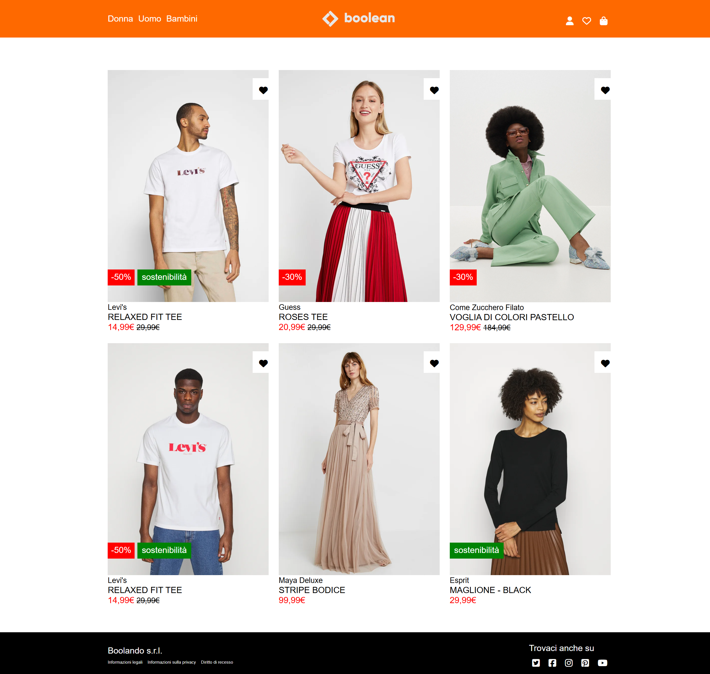

<h1 align="center">Boolando</h1>

###

  
  
  
  
  

###

###

Descrizione Ci ispiriamo al sito di Zalando per riprodurre il layout nello screenshot. Per ogni prodotto sono fornite 2 immagini: la prima sarà visualizzata all'apertura della pagina, la seconda sarà visualizzata al posto della prima, quando il cursore del mouse va in hover sulla card. Sono presenti anche un header in posizione fixed e un footer.  Regole da usare Tutte le regole che abbiamo visto fino ad oggi. Servirà qualche posizionamento particolare? Ai posteri l'ardua sentenza!  Consigli: Analizzate prima il layout solo con i commenti, poi passate ai blocchi colorati. Solo se i blocchi colorati funzionano passiamo al particolare...    Bonus 1 All'hover sul cuoricino, questo diventa rosso  Bonus 2 Crea una seconda pagina che sarà collegata a ciascuna card. Questa è chiamata pagina di dettaglio e dovrebbe contenere la stessa immagine dell’elemento e del testo descrittivo correttamente impaginati. Ricorda di mantenere lo stesso header e una corretta navigazione tra le pagine.

###

